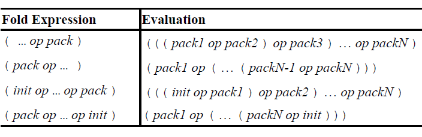

## 可变参数模板示例

```cpp
void print() {} // 没有参数时将调用此函数

template<typename T, typename... Types>
void print(T firstArg, Types... args)
{
  std::cout << firstArg << ' ';  // 打印第一个实参，无参数时将调用此函数
  print(args...); // 调用print()打印其余实参
}

int main()
{
  std::string s("world");
  print(3.14, "hello", s); // 3.14 hello world
}
```

## 重载可变参数和非可变参数模板

* 前一例子也可以如下实现，如果两个函数模板只有尾置参数包不同，会优先匹配没有尾置参数包的版本

```cpp
template<typename T>
void print(T x)
{
  std::cout << x << ' ';
}

template<typename T, typename... Types>
void print(T firstArg, Types... args)
{
  print(firstArg);
  print(args...);
}
```

## [sizeof...运算符](https://en.cppreference.com/w/cpp/language/sizeof...)

* [sizeof...](https://en.cppreference.com/w/cpp/language/sizeof...)用于计算参数包的元素数

```cpp
template<typename T, typename... Types>
void print(T firstArg, Types... args)
{
  std::cout << sizeof...(Types) << '\n'; // print number of remaining types
  std::cout << sizeof...(args) << '\n'; // print number of remaining args
}
```

* 可能会想到将其用于跳过递归结尾，以防缺少实参，但这是错误的

```cpp
template<typename T, typename... Types>
void print(T firstArg, Types... args)
{
  std::cout << firstArg << '\n';
  if (sizeof...(args) > 0) // sizeof...(args)==0时会出错
  {
    print(args...); // 因为print(args...)仍将被初始化，而此时没有实参
  }
}
```

* 函数模板中所有的if语句分支都会被实例化，当对最后一个实参调用print()时，打印了实参后，`sizeof...(args)`为0，但没有实参时print(args...)仍然会初始化，结果就会出错。C++17中引入了编译期if来解决这个问题

```cpp
template<typename T, typename...Types>
void print(const T& firstArg, const Types&... args)
{
  std::cout << firstArg << '\n';
  if constexpr (sizeof...(args) > 0)
  {
    print(args...); // 只在sizeof...(args) > 0时实例化
  }
}
```

## [折叠表达式](https://en.cppreference.com/w/cpp/language/fold)

* C++17引入了折叠表达式，用于获取对所有参数包实参使用二元运算符的计算结果。如下模板将返回所有实参的和

```cpp
template<typename... T>
auto foldSum(T... s)
{
  return (... + s);   // ((s1 + s2) + s3) ...
}
```

* 如果参数包为空，表达式通常是非法的（对空参数包例外的是：&&视为true，||视为false，逗号运算符视为void()）



* 上例中的折叠表达式还可以有如下形式

```cpp
foldSum(1, 2, 3, 4, 5); // 假如实参是12345
// 左边是返回值，右边是计算时的内部展开方式
(... + s)：((((1 + 2) + 3) + 4) + 5)
(s + ...)：(1 + (2 + (3 + (4 + 5))))
(0 + ... + s)：(((((0 + 1) + 2) + 3) + 4) + 5)
(s + ... + 0)：(1 + (2 + (3 + (4 + (5 + 0)))))
```

* 折叠表达式几乎可以使用所有二元运算符

```cpp
struct Node {
  int val;
  Node* left;
  Node* right;
  Node(int i = 0) : val(i), left(nullptr), right(nullptr) {}
};

// 使用operator->*的折叠表达式，用于遍历指定的二叉树路径
template<typename T, typename... Ts>
Node* traverse(T root, Ts... paths)
{
  return (root ->* ... ->* paths); // np ->* paths1 ->* paths2 ...
}

int main()
{
  Node* root = new Node{ 0 };
  root->left = new Node{ 1 };
  root->left->right = new Node{ 2 };
  root->left->right->left = new Node{ 3 };

  auto left = &Node::left;
  auto right = &Node::right;
  Node* node1 = traverse(root, left);
  std::cout << node1->val; // 1
  Node* node2 = traverse(root, left, right);
  std::cout << node2->val; // 2
  Node* node3 = traverse(node2, left);
  std::cout << node3->val; // 3
}
```

* 使用折叠表达式简化打印所有参数的可变参数模板

```cpp
template<typename... Ts>
void print(const Ts&... args)
{
  (std::cout << ... << args) << '\n';
}
```

* 如果想用空格分隔参数包元素，需要使用一个包裹类来提供此功能

```cpp
template<typename T>
class AddSpace {
 public:
  AddSpace(const T& r): ref(r) {}
  friend std::ostream& operator<<(std::ostream& os, AddSpace<T> s)
  {
    return os << s.ref << ' ';   // 输出传递的实参和一个空格
  }
 private:
  const T& ref; // 构造函数中的实参的引用
};

template<typename... Args>
void print(Args... args)
{
  (std::cout << ... << AddSpace(args)) << '\n';
}
```

## 可变参数模板的应用

* 可变参数模板的典型应用是转发任意数量任意类型的实参，比如[std::make_shared](https://en.cppreference.com/w/cpp/memory/shared_ptr/make_shared)就是用它实现的

```cpp
auto p = std::make_shared<std::complex<double>>(3.14, 4.2);
```

* 比如[std::thread的构造函数](https://en.cppreference.com/w/cpp/thread/thread/thread)

```cpp
void f(int, std::string);
std::thread t(f, 42, "hi");
```

* 比如[std::vector::emplace_back](https://en.cppreference.com/w/cpp/container/vector/emplace_back)

```cpp
struct A {
  A(int _i, std::string _s) : i(_i), s(_s) {}
  int i;
  std::string s;
};

std::vector<A> v;
v.emplace_back(1, "hi");
```

* 通常这类实参会使用移动语义进行完美转发，上述例子在标准库中对应的声明如下

```cpp
namespace std {
template<typename T, typename... Args>
shared_ptr<T> make_shared(Args&&... args);

class thread {
 public:
  template<typename F, typename... Args>
  explicit thread(F&& f, Args&&... args);  
  ...
};

template<typename T, typename Allocator = allocator<T>>
class vector {
 public:
  template<typename... Args>
  reference emplace_back(Args&&... args);
  ...
};
}
```

* 除了上述例子，参数包还能用于其他地方，如表达式、类模板、using声明、deduction guide

## 可变参数表达式（Variadic Expression）

* 可以对参数包中的参数进行运算，比如让每个元素翻倍后传递给再打印

```cpp
template<typename... Args>
void print(const Args&... args)
{
  (std::cout << ... << args);
}

template<typename... T>
void printDoubled(const T&... args)
{
  print(args + args...);
}

int main()
{
  printDoubled(3.14, std::string("hi"), std::complex<double>(4, 2));
  // 等价于
  print(3.14 + 3.14, std::string("hi") + std::string("hi"),
    std::complex<double>(4, 2) + std::complex<double>(4, 2));
}
```

* 注意参数包的省略号不能直接接在数值字面值后

```cpp
template<typename... T>
void addOne(const T&... args)
{
  print(args + 1...); // 错误 1...是带多个小数点的字面值，不合法
  print(args + 1 ...); // OK
  print((args + 1)...); // OK
}
```

* 编译期表达式能以同样的方式包含模板参数包

```cpp
template<typename T1, typename... TN>
constexpr bool isHomogeneous(T1, TN...)
{ // 判断是否所有实参类型相同
  return (std::is_same_v<T1, TN> && ...); // since C++17
}

isHomogeneous(1, 2, "hi"); // 结果为false
// 扩展为std::is_same_v<int, int> && std::is_same_v<int, const char*>
isHomogeneous("hello", "", "world", "!") // 结果为true：所有实参都为const char*
```

## 可变参数索引（Variadic Index）

* 下面函数使用一个可变索引列表访问传递的第一个实参对应的元素

```cpp
template<typename... Args>
void print(const Args&... args)
{
  (std::cout << ... << args);
}

template<typename C, typename... N>
void printElems(const C& c, N... n)
{ 
  print(c[n]...);
}

int main()
{
  std::vector<std::string> v{ "good", "times", "say", "bye" };
  printElems(v, 2, 0, 3); // say good bye：等价于print(v[2], v[0], v[3]);
}
```

* 非类型模板参数也可以声明为参数包

```cpp
template<std::size_t... N, typename C>
void printIdx(const C& c)
{
  print(c[N]...);
}

std::vector<std::string> v{ "good", "times", "say", "bye" };
printIdx<2, 0, 3>(v);
```

## 可变参数类模板（Variadic Class Template）

* 可变参数类模板的一个重要例子是[std::tuple](https://en.cppreference.com/w/cpp/utility/tuple)

```cpp
template<class... Types>
class tuple;
 
tuple<int, std::string, char> t;
```

* 另一个例子是[std::variant](https://en.cppreference.com/w/cpp/utility/variant)

```cpp
template<class... Types>
class variant;

variant<int, std::string, char> v;
```

* 也能定义一个类作为表示一个索引列表的类型

```cpp
template<std::size_t...>
struct Indices
{};

template<typename... Args>
void print(const Args&... args)
{
  (std::cout << ... << args);
}

template<typename T, std::size_t... N>
void printByIdx(T t, Indices<N...>)
{
  print(std::get<N>(t)...);
}

int main()
{
  std::array<std::string, 5> arr{ "Hello", "my", "new", "!", "World" };
  printByIdx(arr, Indices<0, 4, 3>()); // HelloWorld!

  auto t = std::make_tuple(12, "monkeys", 2.0);
  printByIdx(t, Indices<0, 1, 2>()); // 12monkeys2
}
```

## 可变参数推断指南（Variadic Deduction Guide）

* C++17的标准库中对[std::array](https://en.cppreference.com/w/cpp/container/array)定义了如下deduction guide

```cpp
namespace std {
template<typename T, typename... U> array(T, U...)
  -> array<enable_if_t<(is_same_v<T, U> && ...), T>, (1 + sizeof...(U))>;
}
```

## 可变参数基类（Variadic Base Class）与using

```cpp
class A {
 public:
  A(const std::string& x) : s(x) {}
  auto f() const { return s; }
 private:
  std::string s;
};

struct A_EQ {
  bool operator() (const A& lhs, const A& rhs) const
  {
    return lhs.f() == rhs.f();
  }
};

struct A_Hash {
  std::size_t operator() (const A& a) const
  {
    return std::hash<std::string>{}(a.f());
  }
};

// 定义一个组合所有基类的operator()的派生类
template<typename... Bases>
struct Overloader : Bases...
{
  using Bases::operator()...;  // OK since C++17
}; 

int main()
{
  // 将A_EQ和A_Hash组合到一个类型中
  using A_OP = Overloader<A_Hash, A_EQ>;

  /* unordered_set的声明
  template<
  class Key,
      class Hash = std::hash<Key>,
      class KeyEqual = std::equal_to<Key>,
      class Allocator = std::allocator<Key>
  > class unordered_set;
  */

  std::unordered_set<A, A_Hash, A_EQ> s1;
  std::unordered_set<A, A_OP, A_OP> s2;
}
```
