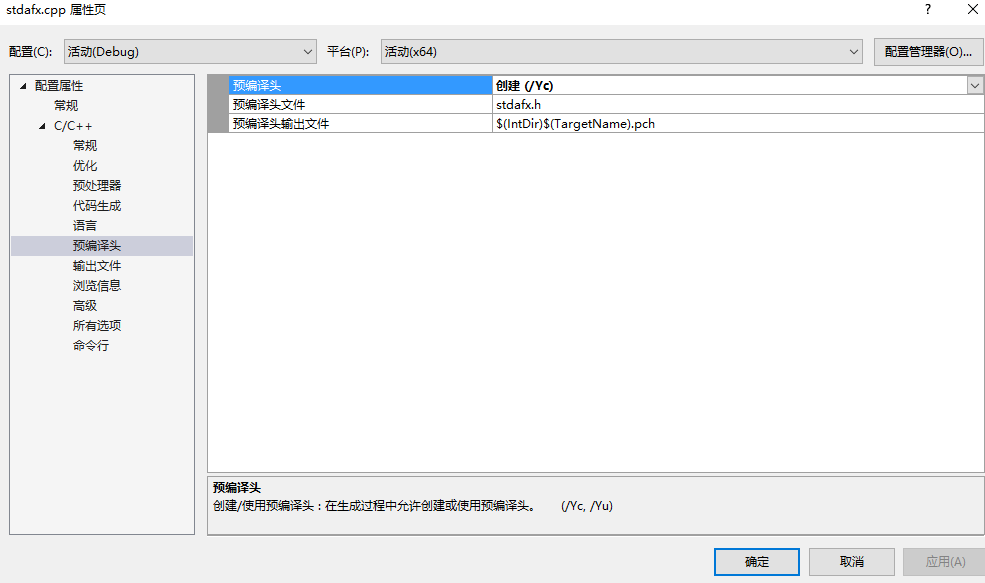

## 链接错误

* 不同于一般代码的是，对模板使用头文件声明、源文件定义的组织方式，编译器会接受，但链接器会产生无法找到函数定义的错误

```cpp
// basics/myfirst.hpp

#ifndef MYFIRST_HPP
#define MYFIRST_HPP

template<typename T>
void printTypeof(const T&);

#endif   // MYFIRST_HPP


// basics/myfirst.cpp

#include "myfirst.hpp"
#include <iostream>

template<typename T>
void printTypeof(const T& x)
{
  std::cout << typeid(x).name() << '\n';
}

// basics/myfirstmain.cpp

#include "myfirst.hpp"

int main()
{
  double pi = 3.14;
  print_typeof(pi); // 为double类型调用函数模板
}
```

* 原因是编译器看到函数调用时，还没看到基于double实例化的函数定义，只是假设在别处提供了定义，并产生一个指向该定义的引用，并让链接器利用该引用解决此问题

## 包含模型

* 对于头文件中声明模板导致链接错误的问题有三个解决方案：一是在模板头文件中包含源文件，二是在每个使用模板的地方包含源文件，三是删掉源文件，直接在头文件中同时包含模板的声明和定义

```cpp
// basics/myfirst2.hpp

#ifndef MYFIRST_HPP
#define MYFIRST_HPP

#include <iostream>

template<typename T>
void printTypeof(const T&);

template<typename T>
void printTypeof(const T& x)
{
  std::cout << typeid(x).name() << '\n';
}

#endif   //MYFIRST_HPP
```

* 模板的这种组织方式称为包含模型，包含模型最大的缺点是增加了包含头文件的开销。主要的开销不是模板定义本身大小，而是其中包含的头文件的大小，<iostream>中包含了许多类似的模板定义，这样会带来成千上万行代码

## 分离模型（已废弃）

* 关键字export可以实现模板头文件和源文件分离，export不能和inline一起使用

```cpp
// 头文件
#ifndef MYFIRST_HPP
#define MYFIRST_HPP

export template<typename T>
void f(const T&);

#endif
```

* 但是export关键字实际上在很多编译中都不支持，C++11中不再使用但保留了该关键字。模板的声明和定义不要分离，定义也应该写在头文件中

## 显式实例化（explicit instantiation）

* [函数模板](https://en.cppreference.com/w/cpp/language/function_template)自身不是类型或函数或任何实体。从仅包含模板定义的源文件不生成代码。为使得代码出现，必须实例化模板，除了隐式实例化，还可以显式实例化

```cpp
template<typename T>
void f(T) {}

template void f<int>(int); // 实例化f<int>(int)，无实参推断
template void f<>(float); // 实例化f<float>(float)，有实参推断
template void f(long); // 实例化f<long>(long)，有实参推断
```

* C++11中在显式实例化中可以使用extern关键字来表示声明而不定义，显式实例化声明将阻止函数模板的隐式实例化。编译器遇到extern模板声明不会在本文件中生成实例化代码，extern表示承诺在程序其他位置有该实例化的一个非extern声明（定义）。对一个给定的实例化版本可能有多个extern声明，但只能有一个定义

```cpp
extern template void f<int>(int); // 声明但不定义
```

* 同理，[类模板](https://en.cppreference.com/w/cpp/language/class_template)也能显式实例化，C++11中也可以使用extern关键字修饰。显式实例化一个类也会实例化所有成员

```cpp
template<typename T>
class A {
 public:
  void f() {}
};

template class A<void>; // 同时显式实例化template void A<void>::f()
template void A<int>::f(); // 仅显式实例化该成员
```

* 显式实例化后，不能再特化实例化过的版本

```cpp
template<typename T>
void f() {}

template void f<int>(); // 显式实例化

template<> // 错误：已经基于int实例化过，不能再对int特化
void f<int>()
{
  std::cout << 1;
}
```

* 但特化过后可以显式实例化，实例化的是特化版本

```cpp
#include <iostream>

template<typename T>
void f()
{}

template<>
void f<int>()
{
  std::cout << 1;
}

template void f<int>(); // 显式实例化的是特化的定义

int main()
{
  f<int>(); // 1
}
```

* 显式实例化不会影响类型推断规则，它只是实例化了一个实体，并不是一个可以优先匹配的非模板函数。从函数模板实例化而来的函数永远不和普通函数等价

```cpp
template<typename T>
void f(T, T) {}

template void f<double>(double, double); // 显式实例化

f(1, 3.14); // 错误：推断类型不一致，不存在可匹配的普通函数void f(double, double)
f<double>(1, 3.14); // OK
```

## 整合包含模型和显式实例化

* 声明的头文件

```cpp
// stack.hpp
#ifndef STACK_HPP
#define STACK_HPP

#include <vector>

template<typename T>
class Stack {
 public:
  Stack();
  void push(const T&);
  void pop();
  T top() const;
 private:
  std::vector<T> elems;
};

#endif
```

* 定义的头文件

```cpp
// stackdef.hpp
#ifndef STACKDEF_HPP
#define STACKDEF_HPP

#include "stack.hpp"
#include <cassert>

template<typename T>
void Stack<T>::push(const T& elem)
{
  elems.push_back(elem);
}

template<typename T>
void Stack<T>::pop()
{
  assert(!elems.empty());
  elems.pop_back();
}

template<typename T>
T Stack<T>::top() const
{
  assert(!elems.empty());
  return elems.back();
}

#endif
```

* 此时包含实现定义的头文件即可直接使用模板，这就是包含模型

```cpp
#include <iostream>
#include <string>
#include "stackdef.hpp"

int main()
{
  Stack<int> intStack;
  intStack.push(42);
  std::cout << intStack.top() << std::endl;
  intStack.pop();

  Stack<std::string> stringStack;
  stringStack.push("hello");
  std::cout << stringStack.top() << std::endl;
  stringStack.pop();
}
```

* 如果只包含声明的头文件，则还需要一个源文件来显式实例化要用到的模板实体。隐式实例化对构建时间有负面影响，而显式实例化能提高编译效率，一是没有隐式实例化的推断过程，二是把显式实例化放到一个文件中让其他文件包含，使用时只要实例化一次，减少了重复实例化次数

```cpp
// stack_inst.cpp
#include "stackdef.hpp"
#include <string>

// instantiate class Stack<> for int
template class Stack<int>;

// instantiate member functions of Stack<> for strings
template Stack<std::string>::Stack();
template void Stack<std::string>::push(std::string const&);
template std::string Stack<std::string>::top() const;
```

* 此时仅包含声明即可使用，但所使用的模板都必须在上述文件中手动实例化过。这也是显式实例化的缺点，必须仔细跟踪哪些实体要实例化，对于大型项目是一个巨大负担

```cpp
#include <iostream>
#include <string>
#include "stack.hpp"

int main()
{
  Stack<int> intStack;
  intStack.push(42);
  std::cout << intStack.top() << std::endl;
  intStack.pop();

  Stack<std::string> stringStack;
  stringStack.push("hello");
  std::cout << stringStack.top() << std::endl;
  stringStack.pop(); // 错误：没有显式实例化std::string版本的此函数
}
```

## 使用显式实例化声明

* 由关键字extern指定的显式实例化称为显式实例化声明，它会抑制隐式实例化，但以下情况例外：
  * 内联函数为了展开内联，仍能被实例化
  * auto或decltype(auto)类型变量和函数返回类型，仍可以被实例化来确定类型
  * 值为常量表达式的变量仍能被实例化以计算它们的值
  * 引用类型变量仍能被实例化，这样引用的实体才能被解析
  * 类模板和别名模板，为了检查生成类型仍能被实例化
* 使用显式实例化声明，可以在头文件中提供模板定义，以此抑制隐式实例化的特化。每个显式实例化声明必须与定义配对，省略定义将引发链接错误

```cpp
// t.hpp:
template<typename T> void f() {}

extern template void f<int>(); // 声明但不定义
extern template void f<float>(); // 声明但不定义

// t.cpp:
template void f<int>(); // 定义
template void f<float>(); // 定义
```

* 不同于手动实例化每需要一个新的特化都要手动更新显式实例化定义列表，显式实例化声明能在任何情况下作为一个优化引入。然而编译时间优化上就不如手动实例化了，因为可能产生一些冗余的隐式实例化，且模板定义也会被作为头文件的一部分解析

## 内联

* 函数模板可以声明为inline或constexpr，说明符放在模板参数列表之后

```cpp
template<typename T>
inline T min(const T&, const T&);
```

* 然而编译器可能忽略这种内联，函数模板是否内联取决于编译器的优化策略

## 预编译头文件

* 即使不存在模板，C++头文件也可以非常巨大，从而需要很长的编译时间，于是一种称为预编译头文件的机制实现了，该机制位于标准范围外，依赖于特定产品实现
* 预编译头文件机制主要依赖于可以使用某种方式组织代码，让多个文件中前面的代码都是相同的，这样可以先编译完这些代码，并把编译器在这一点的状态存储到一个预编译头文件（通常为.pch）中，对于剩下文件的编译只需要先加载上面已经保存的状态，从下一行开始编译就可以了
* 重新加载已保存的状态很快，但第一次编译并保存这个状态比编译这些代码慢，增加的时间代价根据实际情况在20%到200%不等
* 对于被包含的头文件，注意#include包含顺序，不同顺序不能使用预编译头文件
* 管理预编译头文件一种可取的方法是根据头文件的使用频率和稳定性分层，对于那些不会发生变化的头文件进行预编译。但如果在大型项目中，对所有文件预编译的时间可能比其能节省的时间多，因此关键在于对更稳定的头文件进行预编译，在不太稳定的头文件中重用这个稳定的预编译头文件

## 在Visual Studio中使用预编译头

* 给项目添加`stdafx.h`和`stdafx.cpp`文件
* 在`stdafx.h`中添加所有需要的头文件，如

```cpp
#pragma once
#include <vector>
#include <string>
```

* `stdafx.cpp`只需要包含`stdafx.h``

```cpp
#include "stdafx.h"
```

* 打开项目属性，将`配置属性 - C/C++ - 预编译头 - 预编译头`改为`使用`
* 打开stdafx.cpp属性，将`配置属性 - C/C++ - 预编译头 - 预编译头`改为`创建`



* 在其他所有源文件中包含`stdafx.h`即可

```cpp
// file "test.cpp"
#include "stdafx.h" // 相当于在test.h中包含了stdafx.h中的所有头文件
```
