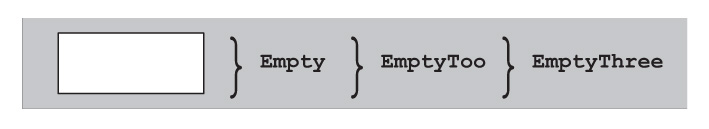
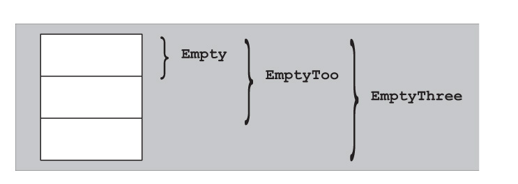
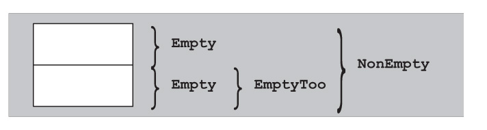

## 空基类优化（EBCO）

### 布局原则

* C++不允许类大小为0，比如数组元素为类时，若类大小为0则数组大小也是0，这会导致指针运算失效。虽然不能存在大小为0的类，但标准规定，空类为基类时，只要不与同一类型的另一个对象或子对象分配在同一地址，就不用分配任何空间

```cpp
#include <iostream>

class Empty {
  using Int = int; // 类型别名成员不会使类非空
};

class EmptyToo : public Empty {};
class EmptyThree : public EmptyToo {};

int main()
{
  std::cout << sizeof(Empty) << sizeof(EmptyToo) << sizeof(EmptyThree);
}
```

* 如果编译器支持EBCO，上述输出结果相同但均不为0，说明EmptyToo中的类Empty没有分配空间，同理类EmptyThree也和类Empty大小相同。但在不支持EBCO的编译器上结果则不同
* 下面是编译器实现EBCO时的布局



* 下面是编译器未实现EBCO时的布局



* 在EBCO中下例依然输出相同的结果

```cpp
#include <iostream>

class Empty {
  using Int = int; // 类型别名成员不会使类非空
};

class EmptyToo : public Empty {};
class NonEmpty : public Empty, public EmptyToo {};

int main()
{
  std::cout << sizeof(Empty) << sizeof(EmptyToo) << sizeof(NonEmpty);
}
```

* NonEmpty的基类Empty和EmptyToo不能分配到同一地址空间，否则EmptyToo的基类Empty会和NonEmpty的基类Empty撞在同一地址空间上，即不允许两个相同类型的子对象偏移量相同
* 下面是编译器实现EBCO时NonEmpty的布局



* 对空基类优化限制的根本原因在于，需要能比较两个指针是否指向同一对象，因为指针总是用地址作内部表示，所以必须保证两个不同的指针值对应两个不同的对象。实际应用中许多类都是继承自一组定义公共typedefs的基类，当这些类作为子对象出现在同一对象中便会出现问题，此时优化应被禁止

### 成员作为基类

* 对于数据成员则不存在类似EBCO的技术，否则指向成员的指针就会有问题，但模板参数可能是空类

```cpp
template<typename T1, typename T2>
class MyClass {
 private:
  T1 a;
  T2 b;
  ...
};
```

* T1或T2都可能是空类，这样`MyClass<T1, T2>`就不能得到最优布局，把模板参数作为基类可以解决这个问题

```cpp
template<typename T1, typename T2>
class MyClass : private T1, private T2 {};
```

* 但T1和T2不一定是类，或者T1和T2是相同类型。如果已知一个模板参数类型为类，另一个类型不是空类，更可行的办法是利用EBCO把可能为空的类型参数与这个成员合并起来

```cpp
template<typename CustomClass>
class Optimizable {
 private:
  CustomClass info; // might be empty
  void* storage;
  ...
};
```

* 改写为

```cpp
template<typename CustomClass>
class Optimizable {
 private:
  BaseMemberPair<CustomClass, void*> info_and_storage;
  ...
};
```

* BaseMemberPair的实现如下，其中的数据成员通过成员函数first()和second()访问

```cpp
template<typename Base, typename Member>
class BaseMemberPair : private Base {
 private:
  Member member;
 public:
  BaseMemberPair(const Base& b, const Member& m)
  : Base(b), member(m) {}

  const Base& first() const
  {
    return (const Base&)*this;
  }

  Base& first()
  {
    return (Base&)*this;
  }

  const Member& second() const
  {
    return this->member;
  }

  Member& second()
  {
    return this->member;
  }
};
```

## 奇异递归模板模式（The Curiously Recurring Template Pattern，CRTP）

* CRTP是一种惯用法，形式上是把派生类作为基类的模板参数，最简单的情形如下

```cpp
template<typename T>
class A {};

class B : public A<B> {};
```

* 如果派生类是类模板

```cpp
template<typename T>
class A {};

template<typename T>
class B : public A<B<T>> {};
```

* 也可以使用模板的模板参数

```cpp
template<template<typename> class T>
class A {};

template<typename T>
class B : public A<B> {};
```

* CRTP的一个简单应用是记录某个类对象构造的总个数

```cpp
#include <iostream>

template<typename T>
class A {
 private:
  inline static std::size_t i = 0;
 protected:
  A() { ++i; }
  A(const A<T>&) { ++i; }
  A(A<T> &&) { ++i; }
  ~A() { --i; }
 public:
  static std::size_t count() // 返回现存A类型对象的数量
  {
    return i; 
  }
};

template<typename T>
class B : public A<B<T>> {};

int main()
{
  B<int> x, y;
  B<char> z;
  std::cout << B<int>::count() << z.count(); // 21
}
```

### Barton-Nackman Trick

* 在1994年，John J. Barton和Lee R. Nackman给出了一项名为限制的模板扩展（restricted template expansion）技术，这项技术的部分动机源于当时大多编译器不支持函数模板重载，也没有实现命名空间
* 为类模板Array定义`operator==`，一种实现方法是把运算符声明为类模板成员，然而这样该运算符的第一个实参（绑定为this指针）和第二个实参转型规则可能不同，无法保证实参的对称性。另一种实现是把运算符声明为一个命名空间作用域函数，如下

```cpp
template<typename T>
class Array {};

template<typename T>
bool operator==(const Array<T>& a, const Array<T>& b)
{
  ...
}
```

* 如果函数模板不能重载，则在此作用域中就不能声明其他`operator==`模板，导致不能为其他类模板提供这个运算符模板。Barton 和Nackman通过把运算符作为友元函数定义在类内部解决了此问题

```cpp
template<typename T>
class Array {
  static bool areEqual(const Array<T>& a, const Array<T>& b);
 public:
  friend bool operator==(const Array<T>& a, const Array<T>& b)
  {
    return areEqual(a, b);
  }
};
```

* 友元的声明会在类模板实例化时跟着插入到全局作用域中，而非模板函数可以重载，该技术被称为限制的模板扩展就是因为避免了使用模板。但友元函数定义名称查找在1994年已经改变了，因此Barton-Nackman trick在标准C++中已经没用了。标准C++通过ADL查找友元函数声明，这意味着友元函数实参必须关联函数所在的类，否则就不能找到该友元函数，即使实参所关联的类能转换为包含友元的类

```cpp
class S {};

template<typename T>
class A {
 public:
  A(T y) : x(y) {} // T到A的隐式转换
  friend void f(const A<T>&) {}
 private:
  T x;
};

int main()
{
  S s;
  A<S> a(s);
  f(a); // OK: A<S>是a的关联类
  f(s); // 错误：A<S>不是s的关联类，找不到f，即使S能转为A
}
```

* 现代C++中，类模板内定义友元函数的唯一优点可能就是写法简单一些了，但其实它还有一个结合CRTP的重要应用

### 结合Barton-Nackman Trick与CRTP的运算符实现

* 通常大量运算符重载会一起出现，比如实现`operator==`的类可能还要实现!=，实现`<`的类可能还要实现`>`，`<=`，`>=`，但通常这些运算符只需要一个定义，其他运算符可以由这一个来实现

```cpp
bool operator!=(const X& x1, const X& x2)
{
  return !(x1 == x2);
}
```

* 如果有大量运算符定义相似的类型，很自然会将运算符归纳成模板

```cpp
template<typename T>
bool operator!=(const T& x1, const T& x2)
{
  return !(x1 == x2);
}
```

* 事实上，标准库中就有[类似定义](https://en.cppreference.com/w/cpp/utility/rel_ops/operator_cmp)，但这些定义在std中可用将造成问题，因此在标准化时被降级到了命名空间std::rel_ops，并将于C++20弃用
* 用CRTP构建这些运算符，就避免了过度通用的运算符的副作用

```cpp
template<typename T>
class A {
 public:
  friend bool operator!=(const T& x1, const T& x2)
  {
    return !(x1 == x2);
  }
};

class X : public A<X> {
 public:
  friend bool operator==(const X& x1, const X& x2)
  {
    // implement logic for comparing two objects of type X
  }
};

int main()
{
  X x1, x2;
  if (x1 != x2) {}
}
```

* 这里结合了CRTP与Barton-Nackman trick，基类使用CRTP为派生类提供一个基于派生类`operator==`定义的`operator!=`，使用Barton-Nackman trick通过一个友元函数提供了定义。结合Barton-Nackman trick的CRTP可以为许多运算符提供基于一些权威运算符的通用定义，这使其成为了C++模板库作者最喜爱的技术

### 外观模式（Facade）

* 结合Barton-Nackman trick与CRTP定义运算符是一个很方便的捷径，把这个思路扩展开，CRTP基类可以根据由CRTP派生类暴露的小得多的接口定义大部分public接口，这个模式称为facade模式，这个模式在定义需要满足一些现有接口（数字类型、迭代器、容器等）的新类型时十分有用。为了阐述facade模式，首先实现一个迭代器facade，它能极大简化一个遵循标准库要求的迭代器的实现。迭代器类型（尤其是随机访问迭代器）需要的接口十分大，下面的类模板骨架简单描述了迭代器接口的要求

```cpp
template<typename Derived, typename Value, typename Category,
  typename Reference = Value&, typename Distance = std::ptrdiff_t>
class IteratorFacade {
 public:
  using value_type = std::remove_const_t<Value>;
  using reference = Reference;
  using pointer = Value*;
  using difference_type = Distance;
  using iterator_category = Category;

  // input iterator interface:
  reference operator*() const { ... }
  pointer operator->() const { ... }
  Derived& operator++() { ... }
  Derived operator++(int) { ... }
  friend bool operator== (const IteratorFacade& lhs,
    const IteratorFacade& rhs) { ... }
  ...

  // bidirectional iterator interface:
  Derived& operator--() { ... }
  Derived operator--(int) { ... }

  // random access iterator interface:
  reference operator[](difference_type n) const { ... }
  Derived& operator+=(difference_type n) { ... }
  ...
  friend difference_type operator-(const IteratorFacade& lhs,
    const IteratorFacade& rhs) { ... }
  friend bool operator<(const IteratorFacade& lhs,
    const IteratorFacade& rhs) { ... }
  ...
};
```

* 为了简洁省略了一些声明，然而实现列出的这些也足够麻烦。幸运的是，这些接口能提取一些核心操作
  * 对所有迭代器
  * dereference()：访问迭代器值（常通过使用operator\*和->）
  * increment()：移动迭代器指向序列中的下个项目
  * equals()：比较两个迭代器是否指向同一个项目
  * 对双向迭代器
  * decrement()：移动迭代器指向列表中的前一个项目
  * 对随机访问迭代器
  * advance()：往前或往后移动迭代器n步
  * measureDistance()：计算两个迭代器之间的距离
* facade的角色是适配一个只实现核心操作提供的类型，从而提供给所有迭代器接口。IteratorFacade的实现主要涉及将迭代器语句映射到最小接口，提供一个成员函数asDerived()访问CRTP派生类

```cpp
Derived& asDerived()
{
  return *static_cast<Derived*>(this);
}

const Derived& asDerived() const
{
  return *static_cast<const Derived*>(this);
}
```

* 通过这个定义就能直接实现大部分facade接口

```cpp
reference operator*() const
{
  return asDerived().dereference();
}

Derived& operator++()
{
  asDerived().increment();
  return asDerived();
}

Derived operator++(int)
{
  Derived result(asDerived());
  asDerived().increment();
  return result;
}

friend bool operator==(const IteratorFacade& lhs, const IteratorFacade& rhs)
{
  return lhs.asDerived().equals(rhs.asDerived());
}

...
```

* 使用IteratorFacade可以很轻松地定义一个链表类的迭代器

```cpp
template<typename T>
class ListNode {
 public:
  T value;
  ListNode(T x) : value(x) {}
  ListNode<T>* next = nullptr;
  ~ListNode() { delete next; }
};

template<typename T>
class ListNodeIterator
: public IteratorFacade<ListNodeIterator<T>, T, std::forward_iterator_tag> {
 public:
  T& dereference() const
  {
    return current->value;
  }
  void increment()
  {
    current = current->next;
  }
  bool equals(const ListNodeIterator& other) const
  {
    return current == other.current;
  }
  ListNodeIterator(ListNode<T>* current = nullptr) : current(current) {}
 private:
  ListNode<T>* current = nullptr;
};
```

* 这个迭代器实现上的一个缺点是，需要将操作暴露为public接口，为了隐藏接口，可以修改IteratorFacade，使其通过一个分离的访问类IteratorFacadeAccess在CRTP派生类上执行操作

```cpp
class IteratorFacadeAccess {
  template<typename Derived, typename Value, typename Category,
    typename Reference, typename Distance>
  friend class IteratorFacade;

  // 所有迭代器的要求
  template<typename Reference, typename Iterator>
  static Reference dereference(const Iterator& i)
  {
    return i.dereference();
  }
  ...

  // 双向迭代器的要求
  template<typename Iterator>
  static void decrement(Iterator& i)
  {
    return i.decrement();
  }

  // 随机访问迭代器的要求
  template<typename Iterator, typename Distance>
  static void advance(Iterator& i, Distance n)
  {
    return i.advance(n);
  }
  ...
};
```

* 迭代器将这个类指定为友元即可将IteratorFacade需要的接口设为private

```cpp
friend class IteratorFacadeAccess;
```

* IteratorFacade使得建立一个迭代器适配器很简单。比如有一个Person容器

```cpp
struct Person {
  std::string firstName;
  std::string lastName;
  friend std::ostream& operator<<(std::ostream& os, const Person& p)
  {
    return os << p.lastName << ", " << p.firstName;
  }
};
```

* 现在只想看到firstName而不需要所有数据，这需要开发一个ProjectionIterator迭代器适配器，它允许将基本迭代器的值投影到某个数据成员的指针上，如`Person::firstName`

```cpp
template<typename Iterator, typename T>
class ProjectionIterator
: public IteratorFacade<
  ProjectionIterator<Iterator, T>,
  T,
  typename std::iterator_traits<Iterator>::iterator_category,
  T&,
  typename std::iterator_traits<Iterator>::difference_type>
{
  using Base = typename std::iterator_traits<Iterator>::value_type;
  using Distance = typename std::iterator_traits<Iterator>::difference_type;

  Iterator iter;
  T Base::* member;

  friend class IteratorFacadeAccess;
  ... // implement core iterator operations for IteratorFacade
 public:
  ProjectionIterator(Iterator iter, T Base::* member)
  : iter(iter), member(member) {}
};

template<typename Iterator, typename Base, typename T>
auto project(Iterator iter, T Base::* member)
{
  return ProjectionIterator<Iterator, T>(iter, member);
}
```

* 每个投影迭代器保存两个值，iter和member，iter是基本序列的迭代器，member是一个数据成员的指针。IteratorFacade的模板参数中，第一个是ProjectionIterator本身（以启用CRTP），第二个（T）和第四个（T&）是投影迭代器的值和引用类型，第三个和第五个只是通过基本迭代器的型别和不同类型传递。因此当Iterator是一个输入迭代器时，投影迭代器也是输入迭代器，Iterator是双向迭代器则投影迭代器也是双向迭代器，以此类推。project()函数使得建立投影迭代器十分简单
* 其中省略的对IteratorFacade的迭代器的部分实现如下

```cpp
T& dereference() const
{
  return (*iter).*member;
}

void increment()
{
  ++iter;
}

bool equals(const ProjectionIterator& other) const
{
  return iter == other.iter;
}

void decrement()
{
  --iter;
}
```

* 使用投影迭代器，可以打印一个包含Person值的vector中的firstName

```cpp
#include <iostream>
#include <vector>
#include <algorithm>
#include <iterator>

int main()
{
  std::vector<Person> authors =
    { {"David", "Vandevoorde"},
    {"Nicolai", "Josuttis"},
    {"Douglas", "Gregor"} };
  std::copy(project(authors.begin(), &Person::firstName),
    project(authors.end(), &Person::firstName),
    std::ostream_iterator<std::string>(std::cout, "\n"));
}

// output
David
Nicolai
Douglas
```

## Mixins

* 考虑一个由一系列点组成的Polygon类

```cpp
class Point {
 public:
  double x, y;
  Point() : x(0.0), y(0.0) {}
  Point(double x, double y) : x(x), y(y) {}
};

class Polygon {
 private:
  std::vector<Point> points;
 public:
  ... // public operations
};
```

* 如果用户可以扩展与每个点关联的信息来包含特定应用的数据，如颜色，这个类将会更有用，因此参数化点的类型

```cpp
template<typename T>
class Polygon {
 private:
  std::vector<T> points;
 public:
  ... // public operations
};
```

* 用户可以使用继承来创建自定义类型的点，但这要求Point类型暴露给用户来继承，并且要小心提供和Point完全一样的接口，否则不能用于Polygon

```cpp
class LabeledPoint : public Point {
 public:
  std::string label;
  LabeledPoint() : Point(), label("") {}
  LabeledPoint(double x, double y) : Point(x, y), label("") {}
};
```

* 使用Mixins手法即可在不使用继承的情况下定制行为，由此可以很方便地引入额外信息而不改变接口

```cpp
template<typename... Mixins>
class Point : public Mixins... {
 public:
  double x, y;
  Point() : Mixins()..., x(0.0), y(0.0) {}
  Point(double x, double y) : Mixins()..., x(x), y(y) {}
};

class Label {
 public:
  std::string label;
  Label() : label("") {}
};

using LabeledPoint = Point<Label>;

// 可以混入多个基类
class Color {
 public:
  unsigned char red = 0, green = 0, blue = 0;
};

using MyPoint = Point<Label, Color>;
```

* 把mixins提供给Polygon类模板本身即可完全隐藏Point类

```cpp
template<typename... Mixins>
class Polygon {
 private:
  std::vector<Point<Mixins...>> points;
 public:
  ... // public operations
};
```

* mixins结合CRTP将变得更强大，下面是一个CRTP-mixin版本的Point，每个mixins是一个类模板，于是现在被混入的属性必须是类模板，即Label和Color等类需要变为类模板。现在可以把之前的计数模板混入Point来计算由Polygon创建的点数量

```cpp
template<template<typename>class... Mixins>
class Point : public Mixins<Point<>>... {
 public:
  double x, y;
  Point() : Mixins<Point<>>()..., x(0.0), y(0.0) {}
  Point(double x, double y) : Mixins<Point<>>()..., x(x), y(y) {}
};

template<typename T>
class A {
 private:
  inline static std::size_t i = 0;
 protected:
  A() { ++i; }
  A(const A<T>&) { ++i; }
  A(A<T> &&) { ++i; }
  ~A() { --i; }
 public:
  static std::size_t count()
  { // 返回现存A类型对象的数量
    return i;
  }
};

using PointCount = Point<A>;

int main()
{
  PointCount a, b, c;
  std::cout << a.count(); // 3
  std::cout << PointCount::count(); // 3
}
```

* Mixins可以参数化成员函数的虚拟性（virtuality，即是否为虚函数）

```cpp
#include <iostream>

class A {};

class B {
 public:
  virtual void f() {}
};

template<typename... Mixins>
class Base : private Mixins... {
 public:
  // f()的虚拟性依赖于Mixins中f()的声明
  void f() { std::cout << "Base::f()" << '\n'; }
};

template<typename... Mixins>
class Derived : public Base<Mixins...> {
 public:
  void f() { std::cout << "Derived::f()" << '\n'; }
};

int main()
{
  Base<A>* p = new Derived<A>;
  p->f(); // calls Base::f()

  Base<B>* q = new Derived<B>;
  q->f(); // calls Derived::f()
}
```

## 命名的模板实参（Named Template Argument）

* 模板常常带有一长串类型参数，不过通常都设有默认值

```cpp
class A {};
class B {};
class C {
 public:
  static void print()
  {
    std::cout << 1;
  }
};
class D {};

template<typename T1 = A, typename T2 = B, typename T3 = C, typename T4 = D>
class MyClass {};
```

* 现在想指定某个实参，而其他参数依然使用默认实参，比如将T3指定为E

```cpp
MyClass<A, B, E> a;
```

* 但这样还需要将指定位置之前的默认实参也写出来，十分繁琐，此时便希望只指定一次就达到相同效果

```cpp
MyClass<SetT3<E>> a;
```

* 要达到这个目的需要将原来的默认实参的别名统一到一个类中，通过指定别名即可使用所需的默认实参

```cpp
class Alias {
 public:
  using P1 = A;
  using P2 = B;
  using P3 = C;
  using P4 = D;
};

template<typename T1 = Alias, typename T2 = Alias,
  typename T3 = Alias, typename T4 = Alias>
class MyClass {
 public:
  void f() { T1::P3::print(); }
};

MyClass a; // 使用默认实参
a.f(); // 1：调用C::print()

template<typename T>
class SetT3 : public Alias {
 public:
  using P3 = T;
};

class E {
 public:
  static void print()
  {
    std::cout << 2;
  }
};

MyClass<SetT3<E>> b;
b.f(); // 2：调用E::print()
```

* 上述只重写了P3，根据需要再把其他情况补充完整即可

```cpp
template<typename T>
class SetT1 : public Alias {
 public:
  using P1 = T;
};

template<typename T>
class SetT2 : public Alias {
 public:
  using P2 = T;
};

template<typename T>
class SetT3 : public Alias {
 public:
  using P3 = T;
};

template<typename T>
class SetT4 : public Alias {
 public:
  using P4 = T;
};
```

* 为了方便，再把参数统一到一个派生类（因为还可能有其他不需要这样处理的参数）

```cpp
template<typename T1 = Alias, typename T2 = Alias,
  typename T3 = Alias, typename T4 = Alias>
class MyClass {
  using Policies = SetBase<T1, T2, T3, T4>; // 指定T1、T2、T3、T4为基类
 public:
  void f() { Policies::P3::print(); }
};
```

* 但不能直接从多个相同的类直接继承

```cpp
template<typename T1, typename T2>
setBase : public T1, public T2 {};

setBase<Alias, Alias> x; // 错误：重复指定基类
```

* 因此需要一个用于生成不同类的中间层

```cpp
template<typename T, int N>
class Mid : public T {};

template<typename T1, typename T2, typename T3, typename T4>
class SetBase : // 把T1、T2、T3、T4作为基类
  public Mid<T1, 1>,
  public Mid<T2, 2>,
  public Mid<T3, 3>,
  public Mid<T4, 4>
{};
```

* 但中间层还是从单个原始类派生的，为了防止多次继承产生二义性，不能直接将别名类用作基类，而是从别名类虚派生一个类用作基类

```cpp
class Args : virtual public Alias {}; // Args也包含了别名P1、P2、P3、P4
```

* 现在应当使用这个虚派生的类作为新的默认实参，此外，用于重写的类也应该使用虚继承。最终所有实现如下

```cpp
#include <iostream>

// 要使用的默认实参
class A {};
class B {};
class C {
 public:
  static void print()
  {
    std::cout << 1;
  }
};
class D {};

// 包含默认实参别名的类，它将作为新的默认实参
// 要使用原来的默认实参（如A）则只需要指定Alias::P1
class Alias {
 public:
  using P1 = A;  
  using P2 = B;
  using P3 = C;
  using P4 = D;
};

// 覆盖别名的类，用来指定某个位置的参数
// 比如MyClass<SetT3<X>>就是将MyClass的模板参数设置为SetT3<X>
// SetT3<X>中只改写了P3 = X，其他别名依然与上述类相同
template<typename T>
class SetT1 : virtual public Alias { // 使用虚继承
 public:
  using P1 = T;
};

template<typename T>
class SetT2 : virtual public Alias {
 public:
  using P2 = T;
};

template<typename T>
class SetT3 : virtual public Alias {
 public:
  using P3 = T;
};

template<typename T>
class SetT4 : virtual public Alias {
 public:
  using P4 = T;
};

// 由于不能从多个相同类直接继承，需要一个中间层用于区分
template<typename T, int N>
class Mid : public T {};

template<typename T1, typename T2, typename T3, typename T4>
class SetBase : // 把T1、T2、T3、T4作为基类
  public Mid<T1, 1>,
  public Mid<T2, 2>,
  public Mid<T3, 3>,
  public Mid<T4, 4>
{};

// Alias要被用作默认实参，但SetBase会将其多次指定为Mid的基类
// 为了防止多次继承产生二义性，虚派生一个新类替代Alias作为默认实参
class Args : virtual public Alias {}; // Args即包含了别名P1、P2、P3、P4

// 最终类的默认实参都使用相同的Args
template<typename T1 = Args, typename T2 = Args,
  typename T3 = Args, typename T4 = Args>
class MyClass {
  using Policies = SetBase<T1, T2, T3, T4>; // 即把Args作为基类
 public:
  void f()
  {
    Policies::P3::print(); // P3即C，因此就是调用C::print()
  }
};

// 新定义一个类，用作下面的指定参数
class E {
 public:
  static void print()
  {
    std::cout << 2;
  }
};

int main()
{
  MyClass a; // 使用默认实参
  a.f(); // 1：调用C::print()
  MyClass<SetT3<E>> b; // P3现在是E的别名，相当于指定T3为E
  b.f(); // 2：调用E::print()
}
```
